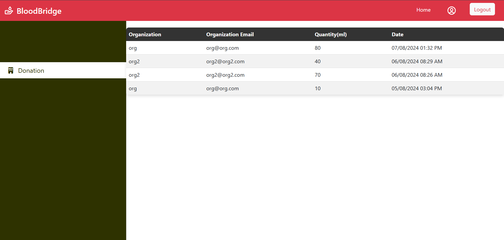

# Blood Bank Mern Stack Project

Welcome to the Blood Bank Project! This project involves a complete blood bank management system built using the MERN stack. Below are the key pages of the application organized by categories:

## 1. **Login and Registration Pages**
These are the initial pages for users to login or register on the system.

### Login Page
Here’s a screenshot of the Login Page.

### Registration Page
Here’s a screenshot of the Registration Page.

## 2. **Donor Related Pages**
These pages are for the donor's profile and related functionality.

### Donor Page
Here’s a screenshot of the Donor Page.

## 3. **Administrator Related Pages**
These pages are for the admin's functionality, including analytics and management.

### Admin Analytics Page
Here’s a screenshot of the Admin Analytics Page.

### Admin Page
Here’s a screenshot of the Admin Page.

## 4. **Hospital Page**
Here’s a screenshot of the Hospital Page.

## 5. **Organisation Related Pages**
These pages are for the organisation's functionality.

### Organisation Analytics Page
Here’s a screenshot of the Organisation Analytics Page.

### Organisation Inventory Page
Here’s a screenshot of the Organisation Inventory Page.

### Organisation Page
Here’s a screenshot of the Organisation Page.

## 6. **Profile Page**
Here’s a screenshot of the Profile Page.

## Conclusion
This project demonstrates the functionality of a blood bank management system built with the MERN stack. The system provides easy management for blood donors, hospitals, organisations, administrators.
